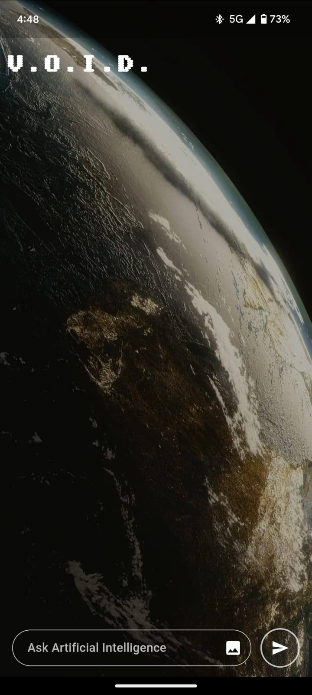
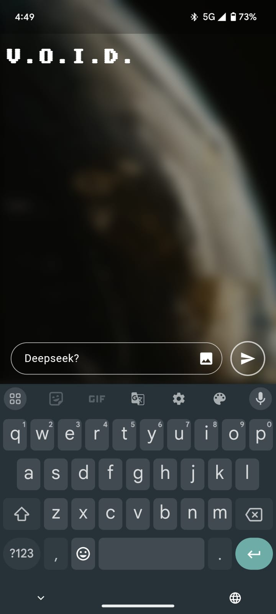
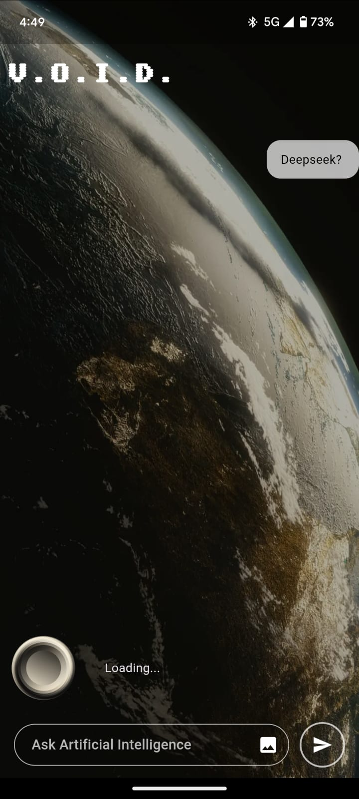
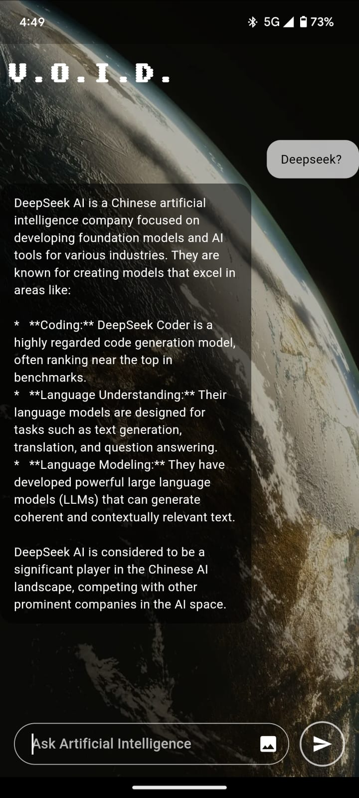

# **artificial_intelligence**

A Flutter-based AI chatbot application powered by **Gemini AI**, designed to provide real-time AI-generated responses with a sleek UI.

## **Features**

- ✨ **Real-time Chat** – Engage with an AI chatbot seamlessly.
- 📱 **Sleek UI** – Modern chat interface with smooth animations.
- 🤖 **AI Response Generation** – Uses Google's Gemini API for intelligent responses.
- 🔥 **State Management** – Implemented using **Flutter BLoC** for efficient state handling.
- 🎨 **Lottie Animations** – Enhanced UI with engaging animations.

---

## **Screenshots**

| Chat Screen                              | Background Blur when Typing                  | Loading Animation while AI is Typing     | AI Response with User Message                |
|------------------------------------------|----------------------------------------------|------------------------------------------|----------------------------------------------|
|  |  |  |  |

*(Make sure these images exist in `assets/screenshots/` before committing!)*

---

## **Installation**

1. **Clone the repository**
   ```sh
   git clone https://github.com/DhruvChaurasia9403/artificial_intelegence.git
   cd artificial_intelegence
